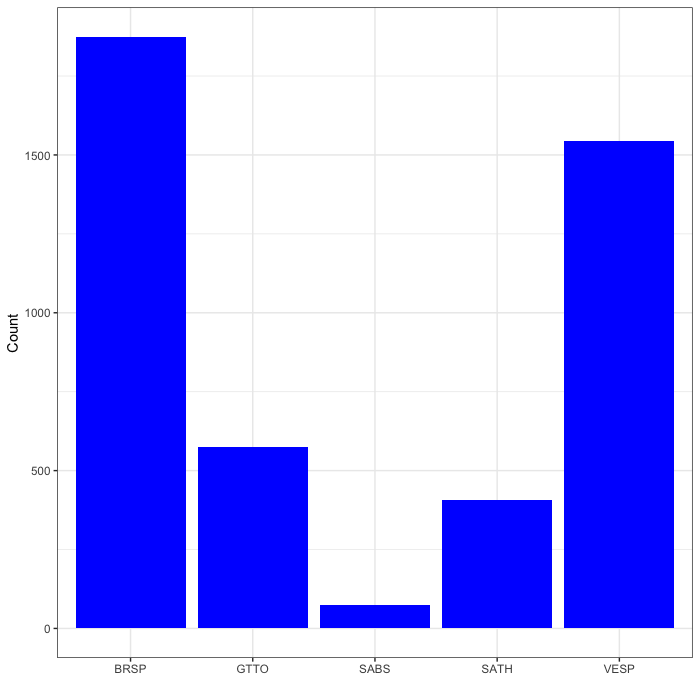
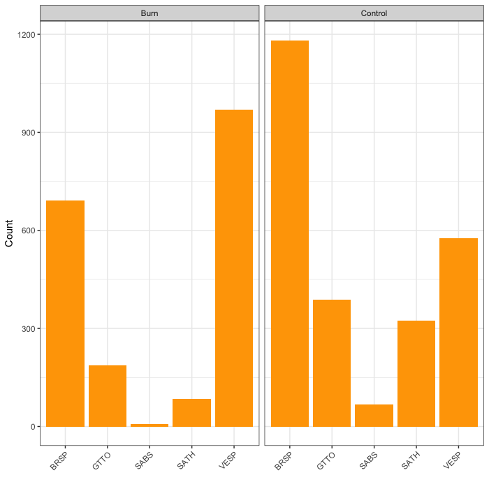

# Plotting counts of focal species

Now, let's do some basic visualization of the counts of focal sagebrush-obligate and near-obligate songbirds from the 2022 surveys. We'll do just a season-wide count bar plot and a season-wide bar plot broken down by plot type (burned and control).

## Plotting counts of focal species

Our focal species are Brewer's Sparrows (BRSP), Sage Thrashers (SATH), Sagebrush Sparrows (SABS), Green-tailed Towhees (GTTO), and Vesper Sparrows (VESP). First we'll plot the season-wide counts:


```{r echo=FALSE, fig.cap="Counts of five focal species in 2022", fig.align='center', out.width='100%'}

```

Brewer's Sparrows and Vesper Sparrows are most common, with tracks with anectodal observations.

## Plotting counts of focal species by plot type

Next let's look at how counts differ by plot type:

```{r echo=FALSE, fig.cap="Counts of five focal species in 2022 by plot type", fig.align='center', out.width='100%'}

```


Given that Vesper Sparrows prefer open ground, it makes sense that they dominate burned plots, while Brewer's Sparrows, which prefer sage cover, dominate control plots.
