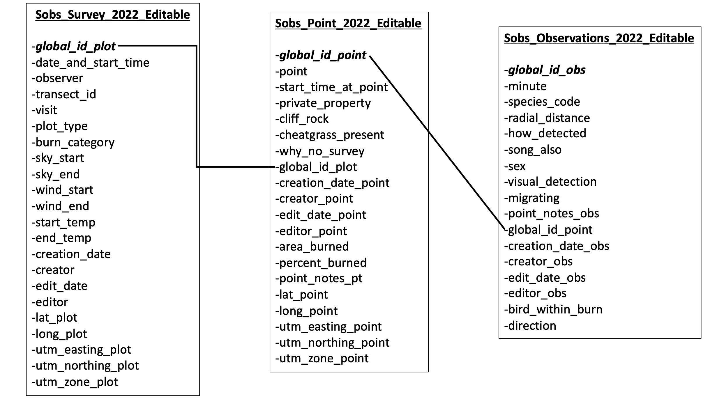

--- 
title: "Data Management for 2022 Box Elder County and Cassia County Sagebrush-Obligate Songbird Surveys"
author: "Rory Eggleston"
date: "`r Sys.Date()`"
site: bookdown::bookdown_site
documentclass: book
bibliography: [book.bib, packages.bib]
# url: your book url like https://bookdown.org/yihui/bookdown
# cover-image: path to the social sharing image like images/cover.jpg
description: |
  This book documents the process for creating a database from the sagebrush-obligate songbird data we collected in Box Elder and Cassia counties during the 2022 field season. It will also describe the data cleaning process and contain some initial figures and analyses.
link-citations: yes
github-repo: rstudio/bookdown-demo
---

# Introduction 

To examine how sagebrush-obligate songbirds (SOBS) respond to habitat changes and recovery associated with wildfires, we collected point count data on SOBS in northwest Utah and south-central Idaho across 30 pairs of burned and control plots. Data was collected in a single data collection form using Survey123. Each plot was 1km x 1km and contained a minimum of 10 equally-spaced points that were 125m from the plot border and 250m from each other point. The data collection form was structured such that every new form constituted a new visit to a specific 1km plot. Within that form, observers added a nested point form for each point surveyed. Within each point, each observation of individual or large groups of birds was added. As such, there were three levels of data collected: each visit to each site, the points within each of those visits, and the observations at each of those points. Survey123 generated a unique global ID field for each row in each of these levels, and these global IDs are used to link points to each visit and observations to each point and each visit.

## Building the Database

To begin, I first created a database file using RSQLite:

```{r eval=FALSE}
sobs_db <- dbConnect(RSQLite::SQLite(), 
                     "/Users/roryeggleston/Documents/WILD6900_DataScience/Sobs_DataManagement/code/sobs.db")
```

I started building the database by creating a table for the visit-level data using the following code:

```{r eval=FALSE}
dbExecute(sobs_db, "CREATE TABLE sobs_survey (
  global_id_plot text NOT NULL,
  date_and_start_time_plot text,
  observer_plot text,
  transect_id text,
  visit char(2),
  plot_type varchar(20),
  burn_category text,
  sky_start char(1),
  sky_end char(1),
  wind_start char(1),
  wind_end char(1),
  start_temp varchar(3),
  end_temp varchar(3),
  creation_date_plot text,
  creator_plot text,
  edit_date_plot text,
  editor_plot text,
  lat_plot double,
  long_plot double,
  utm_easting_plot double,
  utm_northing_plot double,
  utm_zone_plot char(2),
  PRIMARY KEY (global_id_plot)
);")
```

Very little of the visit-level data is numeric, so I opted to store most fields as text or characters, with the exception of coordinates. The global ID of the plot visit is the primary key for this table.

I populated the table as follows, first reading in the CSV document, checking the column names, and then writing the data into the newly-created table:

```{r eval=FALSE}
sobs_survey <- read.csv("/Users/roryeggleston/Documents/WILD6900_DataScience/Sobs_DataManagement/data/Sobs_Survey_2022_Editable.csv",
                        stringsAsFactors = FALSE)
names(sobs_survey)

dbWriteTable(sobs_db, "sobs_survey", sobs_survey, append = TRUE)
```

I then made sure that all of this had run correctly:

```{r eval=FALSE}
dbGetQuery(sobs_db, "SELECT * FROM sobs_survey LIMIT 10;")
```

It did, so I proceeded to created a table for the point-level data, read in the associated CSV, write it to the new table, and check that it had worked:

``` {r eval=FALSE}
dbExecute(sobs_db, "CREATE TABLE sobs_point (
          global_id_point text NOT NULL,
          point text,
          start_time_at_point text,
          private_property varchar(3),
          cliff_rock varchar(3),
          cheatgrass_present varchar(3),
          why_no_survey text,
          global_id_plot text NOT NULL,
          creation_date_point text,
          creator_point text,
          edit_date_point text,
          editor_point text,
          area_burned varchar(3),
          percent_burned integer,
          point_notes_pt text,
          lat_point double,
          long_point double,
          utm_easting_point double,
          utm_northing_point double,
          utm_zone_point char(2),
          PRIMARY KEY (global_id_point),
          FOREIGN KEY (global_id_plot) REFERENCES sobs_survey(global_id_plot)
          );")

sobs_point <- read.csv("/Users/roryeggleston/Documents/WILD6900_DataScience/Sobs_DataManagement/data/Sobs_Point_2022_Editable.csv",
                       stringsAsFactors = FALSE)
names(sobs_point)

dbWriteTable(sobs_db, "sobs_point", sobs_point, append = TRUE)

dbGetQuery(sobs_db, "SELECT * FROM sobs_point LIMIT 10;")
```

For the point-level data, the primary key is the global id for the point data, and the foreign key linking each visit to its associated points is the global ID for the visit-level data. Apart from percentages and coordinates, most of this data is categorical, and so it stored as text or characters.

The point-level data table worked, so I ran through the same procedures for the observation-level data:

```{r eval=FALSE}
dbExecute(sobs_db, "CREATE TABLE sobs_obs (
          global_id_obs text,
          minute integer,
          species_code varchar(5),
          radial_distance integer,
          how_detected char(1),
          song_also varchar(3),
          sex char(1),
          visual_detection varchar(3),
          migrating varchar(3),
          point_notes_obs text,
          global_id_point text,
          creation_date_obs text,
          creator_obs text,
          edit_date_obs text,
          editor_obs text,
          bird_within_burn varchar(3),
          direction varchar(20),
          PRIMARY KEY (global_id_obs),
          FOREIGN KEY (global_id_point) REFERENCES sobs_point(global_id_point)
);")

sobs_obs <- read.csv("/Users/roryeggleston/Documents/WILD6900_DataScience/Sobs_DataManagement/data/Sobs_Observations_2022_Editable.csv",
                       stringsAsFactors = FALSE)
names(sobs_obs)

dbWriteTable(sobs_db, "sobs_obs", sobs_obs, append = TRUE)

dbGetQuery(sobs_db, "SELECT * FROM sobs_obs LIMIT 10;")
```

For the observation-level data, the observation global ID is the primary key, and the foreign key is the global ID for the point-level data. As bird species are initially collected as character data, most of the data in this table is again stored as text or characters. This table will need to be converted into a frequency table, but for now, this set-up will work.


## Visualizing Database Structure

Based on the code above, the database should be structured like this:

```{r echo=FALSE, image, fig.cap="2022 SOBS Data Database Structure", fig.align='center', out.width='100%'}

```


